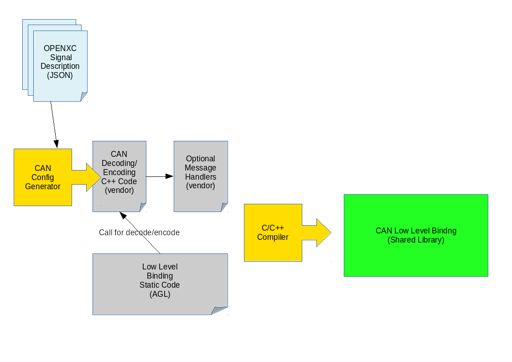
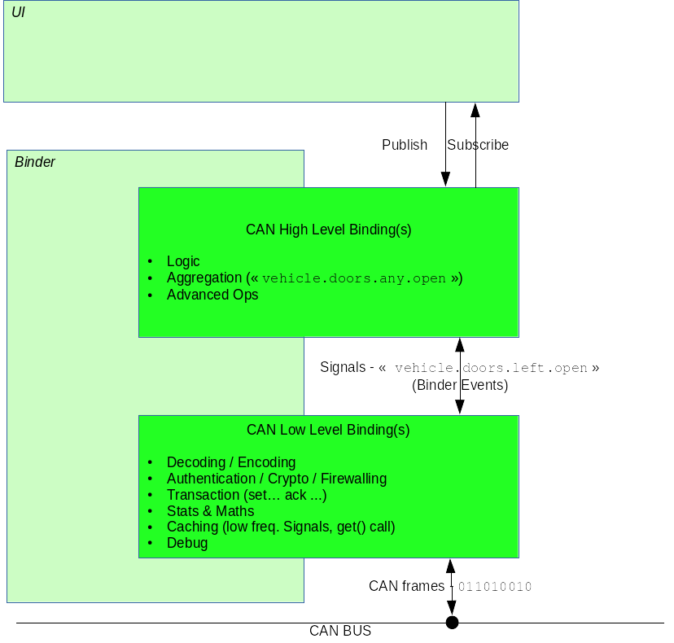
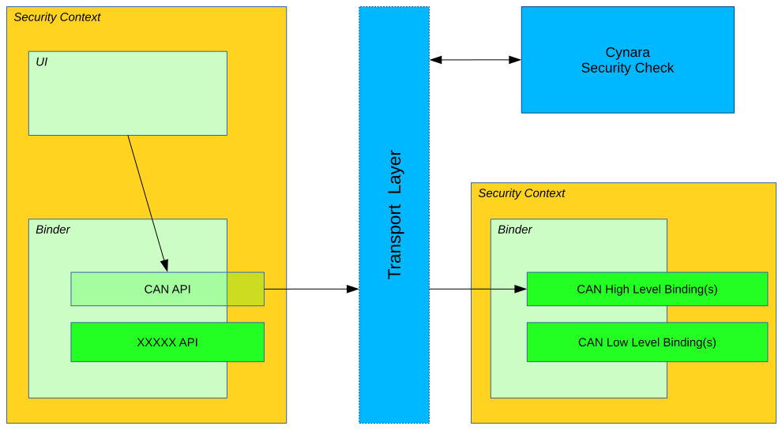

# AGL CAN binding architecture proposal

It's meant to generate from a JSON file describing CAN messages and diagnostic message \(OBD2 for now\), a cpp file to integrate with the project.

Once generated binding is built with it and result will be a widget file to install on an AGL target system.

Bringing CAN management into the AGL project is more than allowing decode and print CAN messages, lot of tools can do that (Wireshark, CAN-utils, ...).

The goal is to provide a common API and abstraction to the CAN bus then you can bring some more high level functionalities to the system.

CAN binding will be separated in two parts:

- High level: Binding from which others applications will connect to.
It will provides valuable access to the CAN bus by aggregate signals or providing new signals from several originals. For example, a signal exposing whether or not a door is open, no matter which one it is. Also, we can imagine an application which supervise if there is no one in the car but moving (1m, 2m ?) to alert the owner of an unexpected behavior. The high level binding will sends a single event representing that behavior to the application which in turn will send a phone message to.

- Low level: Decode messages that transit and send event through **Application Framework** to the subscribers with human readable message. It provides some basic access to the bus + some basic mathematical, statistical features (last_values, min, max, timestamps, averaging) as well as basic filter to get discerning signal only (This part are not implemented yet in the low level).

Last be not least, the low level binding can be shipped as binary only using OpenXC inspired [AGL low level CAN binding Generator](http://github.com/iotbzh/can-config-generator).
